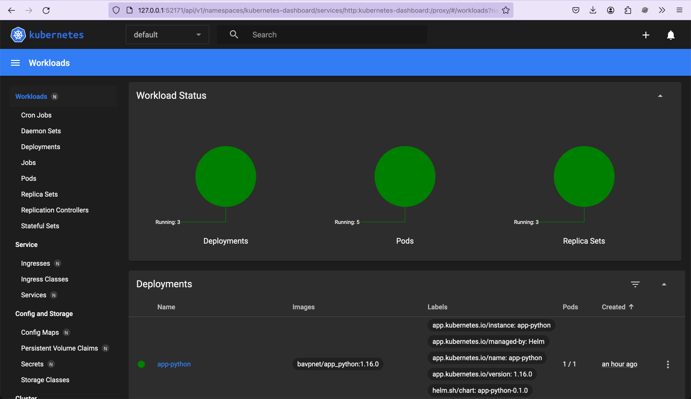

# Lab 10: Introduction to Helm

1. Firstly, I need create a chart `helm create app-python`

2. Next, you should delete the services from the lab 9 (in my case there ia the same names)

3. I need to install helm in my directory with specific name `helm install app-python`
```bash
NAME: app-python
LAST DEPLOYED: Tue Apr  9 20:14:02 2024
NAMESPACE: default
STATUS: deployed
REVISION: 1
NOTES:
1. Get the application URL by running these commands:
  export NODE_PORT=$(kubectl get --namespace default -o jsonpath="{.spec.ports[0].nodePort}" services app-python)
  export NODE_IP=$(kubectl get nodes --namespace default -o jsonpath="{.items[0].status.addresses[0].address}")
  echo http://$NODE_IP:$NODE_PORT

```


4. I can call `minikube service app-python`
```bash
|-----------|------------|-------------|---------------------------|
| NAMESPACE |    NAME    | TARGET PORT |            URL            |
|-----------|------------|-------------|---------------------------|
| default   | app-python |        5001 | http://192.168.49.2:32738 |
|-----------|------------|-------------|---------------------------|
🏃  Starting tunnel for service app-python.
|-----------|------------|-------------|------------------------|
| NAMESPACE |    NAME    | TARGET PORT |          URL           |
|-----------|------------|-------------|------------------------|
| default   | app-python |             | http://127.0.0.1:51474 |
|-----------|------------|-------------|------------------------|

```

5. Also, we can check outputs `minikube get pods, svc`

```bash
kubectl get pods,svc
NAME                               READY   STATUS    RESTARTS      AGE
pod/app-python-548979fcb7-2972z    1/1     Running   1 (30s ago)   7d
pod/app-python-548979fcb7-7gzsx    1/1     Running   1 (30s ago)   7d
pod/app-python-548979fcb7-9pmdt    1/1     Running   1 (30s ago)   7d

NAME                      TYPE           CLUSTER-IP       EXTERNAL-IP   PORT(S)          AGE
service/kubernetes        ClusterIP      10.96.0.1        <none>        443/TCP          9d
service/app-python        LoadBalancer   10.110.153.226   <pending>     5001:51474/TCP   7d
```




## Task 2 - hooks

1. Firstly, I lint helm `helm lint app-python`
2. Next, I install using `helm install --dry-run helm-hooks app-python`
```bash
NAME: helm-hooks
LAST DEPLOYED: Tue Apr  9 22:08:35 2024
NAMESPACE: default
STATUS: pending-install
REVISION: 1
HOOKS:
---
# Source: app-python/templates/post-install-hook.yaml
apiVersion: v1
kind: Pod
metadata:
  name: postinstall-hook1
  annotations:
    "helm.sh/hook": "post-install"
    "helm.sh/hook-delete-policy": hook-succeeded
spec:
  containers:
  - name: post-install-container
    image: busybox
    imagePullPolicy: Always
    command: ['sh', '-c', 'sleep 10']
  restartPolicy: Never
  terminationGracePeriodSeconds: 0
---
# Source: app-python/templates/tests/test-connection.yaml
apiVersion: v1
kind: Pod
metadata:
  name: "helm-hooks-app-python-test-connection"
  labels:
    helm.sh/chart: app-python-0.1.0
    app.kubernetes.io/name: app-python
    app.kubernetes.io/instance: helm-hooks
    app.kubernetes.io/version: "1.16.0"
    app.kubernetes.io/managed-by: Helm
  annotations:
    "helm.sh/hook": test
spec:
  containers:
    - name: wget
      image: busybox
      command: ['wget']
      args: ['helm-hooks-app-python:5001']
  restartPolicy: Never
MANIFEST:
---
# Source: app-python/templates/serviceaccount.yaml
apiVersion: v1
kind: ServiceAccount
metadata:
  name: helm-hooks-app-python
  labels:
    helm.sh/chart: app-python-0.1.0
    app.kubernetes.io/name: app-python
    app.kubernetes.io/instance: helm-hooks
    app.kubernetes.io/version: "1.16.0"
    app.kubernetes.io/managed-by: Helm
automountServiceAccountToken: true
---
# Source: app-python/templates/service.yaml
apiVersion: v1
kind: Service
metadata:
  name: helm-hooks-app-python
  labels:
    helm.sh/chart: app-python-0.1.0
    app.kubernetes.io/name: app-python
    app.kubernetes.io/instance: helm-hooks
    app.kubernetes.io/version: "1.16.0"
    app.kubernetes.io/managed-by: Helm
spec:
  type: LoadBalancer
  ports:
    - port: 5001
      targetPort: 5001
      protocol: TCP
      name: http
  selector:
    app.kubernetes.io/name: app-python
    app.kubernetes.io/instance: helm-hooks
---
# Source: app-python/templates/statefulset.yaml
apiVersion: apps/v1
kind: Deployment
metadata:
  name: helm-hooks-app-python
  labels:
    helm.sh/chart: app-python-0.1.0
    app.kubernetes.io/name: app-python
    app.kubernetes.io/instance: helm-hooks
    app.kubernetes.io/version: "1.16.0"
    app.kubernetes.io/managed-by: Helm
spec:
  replicas: 1
  selector:
    matchLabels:
      app.kubernetes.io/name: app-python
      app.kubernetes.io/instance: helm-hooks
  template:
    metadata:
      labels:
        helm.sh/chart: app-python-0.1.0
        app.kubernetes.io/name: app-python
        app.kubernetes.io/instance: helm-hooks
        app.kubernetes.io/version: "1.16.0"
        app.kubernetes.io/managed-by: Helm
    spec:
      serviceAccountName: helm-hooks-app-python
      securityContext:
        {}
      containers:
        - name: app-python
          securityContext:
            {}
          image: "bavpnet/app_python:1.16.0"
          imagePullPolicy: IfNotPresent
          ports:
            - name: http
              containerPort: 5001
              protocol: TCP
          livenessProbe:
            httpGet:
              path: /
              port: http
          readinessProbe:
            httpGet:
              path: /
              port: http
          resources:
            {}
```

3. Output of `kubectl get po`

```bash
NAME                                    READY   STATUS             RESTARTS     AGE
app-python-1712681625-fb99c7c79-tl99m   1/1     Running            0            137m
app-python-7bf5f94f6c-7wlhd             1/1     Running            1 (30m ago)  115m
app-python-depl-548979fcb7-2972z        1/1     Running            0            9d
app-python-depl-548979fcb7-7gzsx        1/1     Running            0            9d
app-python-depl-548979fcb7-9pmdt        1/1     Running            0            9d
```